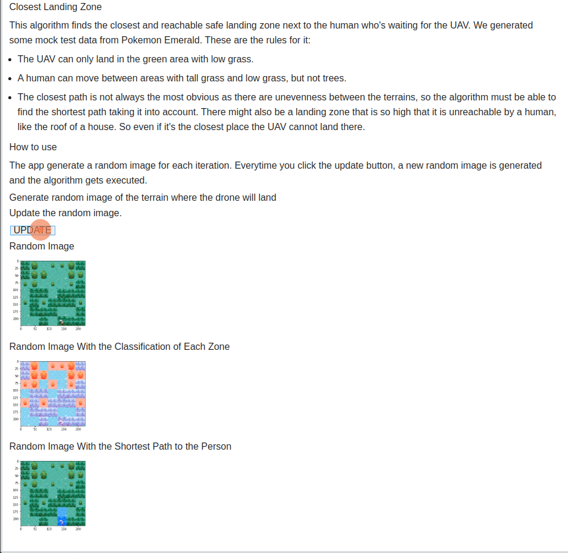
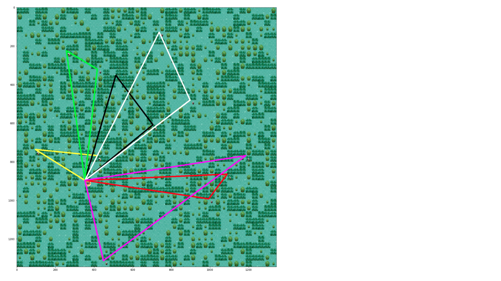

# Closest Landing Zone
This algorithm finds the closest and reachable safe landing zone next to the human who's waiting for the autonomous UAV.

**List Number**: X 
**Discipline Subject**: Graphs II 

## Students
|Number | Student |
| -- | -- |
| 17/0146251  |  João Lucas Zarbiélli |
| 19/0046945  |  Leonardo Michalski Miranda |

## About
We generated some mock test data from Pokemon Emerald. These are the rules for it:

* The UAV can only land in the green area with low grass.

* A human can move between areas with tall grass and low grass, but not trees.

The closest path is not always the most obvious as there are unevenness between the terrains, so the algorithm must be able to find the shortest path taking it into account. There might also be a landing zone that is so high that it is unreachable by a human, like the roof of a house. So even if it's the closest place the UAV cannot land there.

## App Gif

## Video (pt-br, [download link](https://raw.githubusercontent.com/projeto-de-algoritmos/Grafos2_ClosestLandingZone/main/assets/app_video.mp4))

## How to run
**Language**: Python. 
**Frameworks**: OpenCV; Jupyter Voilà; BinderHub. 
Access the [app](https://mybinder.org/v2/gh/projeto-de-algoritmos/Grafos2_ClosestLandingZone/main?urlpath=%2Fvoila%2Frender%2Fapp.ipynb) or the [notebook](https://mybinder.org/v2/gh/projeto-de-algoritmos/Grafos2_ClosestLandingZone/main?filepath=app.ipynb) with the BinderHub server.

## How to use

The app generate a random image for each iteration. Everytime you click the update button, a new random image is generated and the algorithm gets executed.

## References

Jupyter et al., "Binder 2.0 - Reproducible, Interactive, Sharable
Environments for Science at Scale." Proceedings of the 17th Python
in Science Conference. 2018. doi://10.25080/Majora-4af1f417-011
