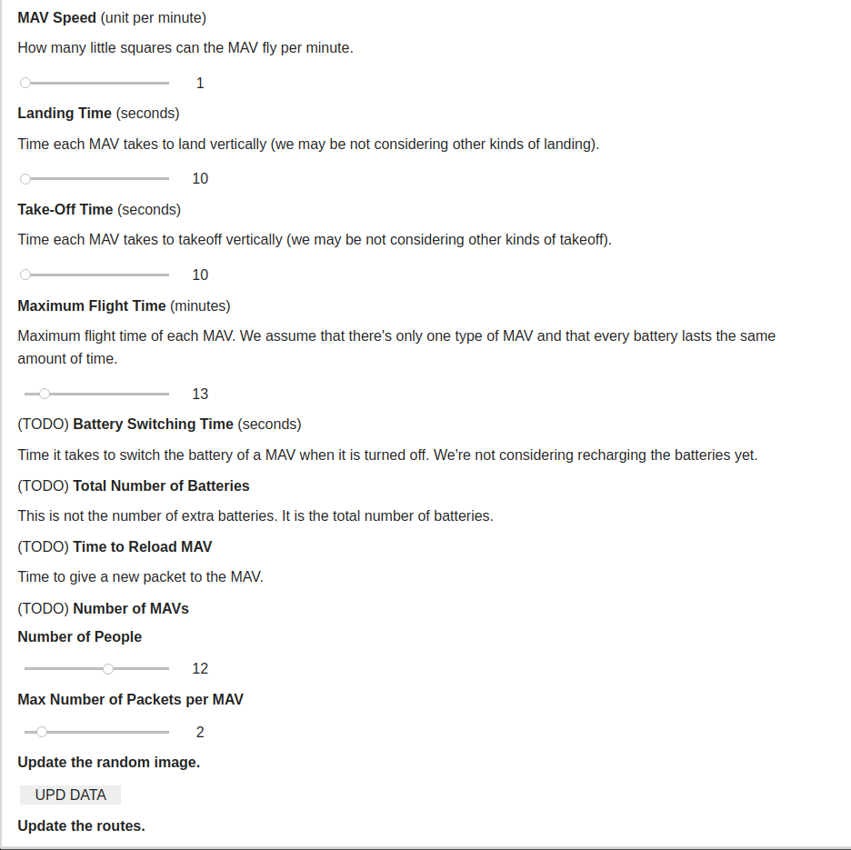
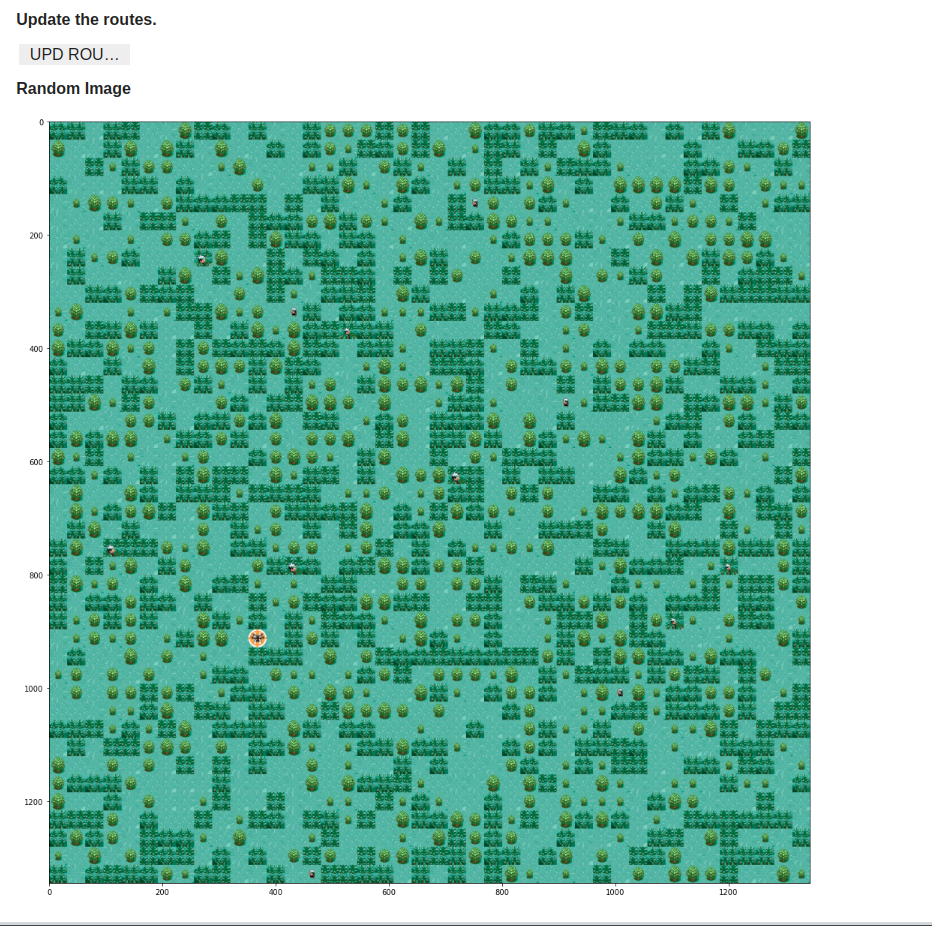
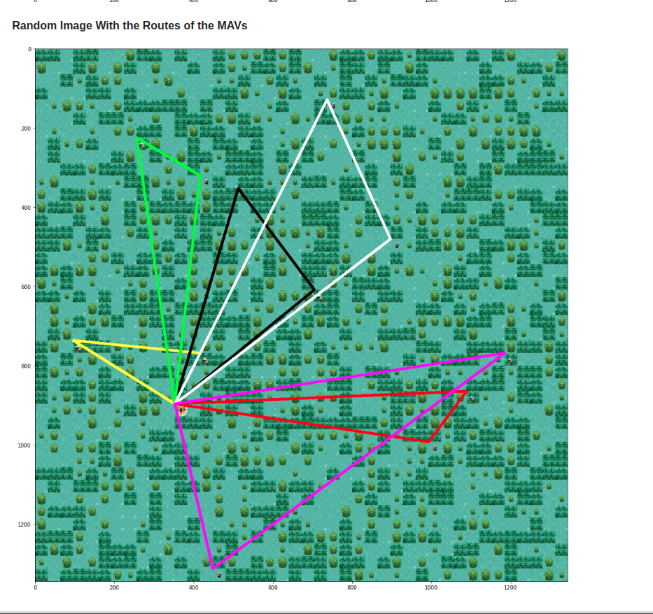
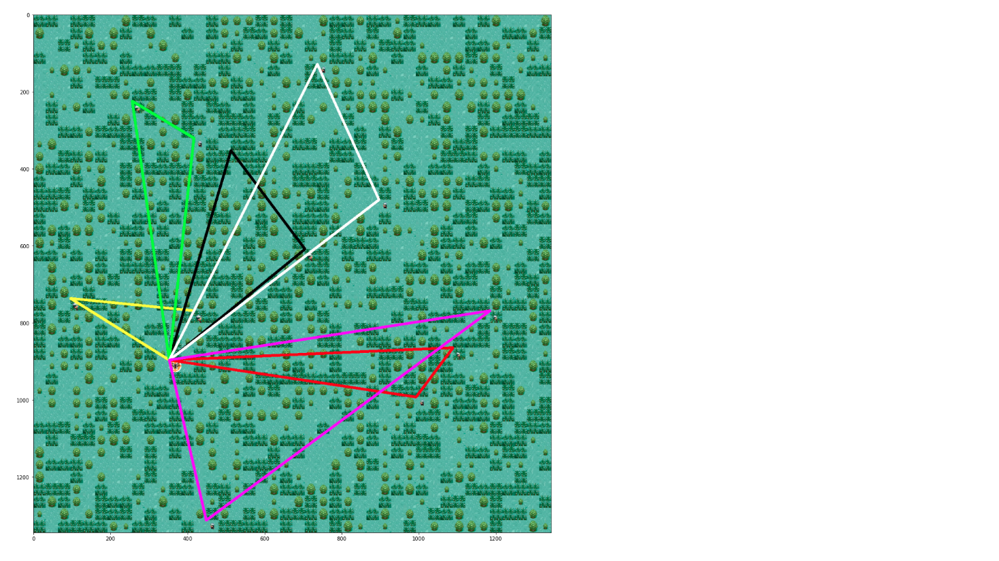

# Greed_DisasterAidPreFlightPlanning
Multiple Micro Air Vehicles (MAVs) Pre-Flight Planning for Delivering Supplies Immediately After a Disaster.

**List Number**: X 
**Discipline Subject**: Greed 

## Students
|Number | Student |
| -- | -- |
| 17/0146251  |  João Lucas Zarbiélli |
| 19/0046945  |  Leonardo Michalski Miranda |

## About
#### Data
We generated some mock test data from Pokemon Emerald. These are the rules for it:

* The MAV can only land in the green area with low grass.

* A human can walk on areas with tall grass and low grass, but not on areas with trees.

#### Algorithms
Those algorithms are part of a research in progress. Another part of this work is in the following repository: https://github.com/projeto-de-algoritmos/Grafos2_ClosestLandingZone

* **1. Find closest landing zone**: Dijkstra-like algorithm with the human as its initial point. It finds the shortest path to all landing zones the human could reach and chooses only the closest one.
  * **Inputs**:
    * **Adjacency matrix**: It's a matrix with the classification of each zone. The possible classifications are: 'MAV can land and human can reach', 'MAV cannot land and human can reach', 'MAV cannot land and human cannot reach'. A plain house roof would be classified as 'MAV can land and human can reach', that's where the height map comes in.
    * **Height map**: The closest landing zone is not always the one that's closest to the human in the 2D picture the MAV took. We need to take the third dimension into account. So we can avoid landing, for example, at the roof of a house that is really close to the human. That's why our algorithm also receives a height map as input. This could be achieved in the real world with some kind of [Depth Estimation](https://beyondminds.ai/blog/depth-estimation/).
    * **Human coordinate**: The adjacency matrix coordinate of the human to whom the supply should be delivered.
  * **Outputs**:
    * The shortest path from the human to the closest landing zone and the path's total distance.

* **2. Pre-Flight Planning**: The algorithm 1 finds routes that don't exceed the MAVs maximum flight time and, at the same time, heads back to the home location (the orange helipad). Then, the algorithm 2 schedules the take-off time of the MAVs. The focus of the algorithms is not to minimize the delivery time, but the battery consumption. We only implemented the algorithm 1, which resembles Prim, due to our time limits.

## App Screenshots

## Video (pt-br, [download link](https://raw.githubusercontent.com/projeto-de-algoritmos/Greed_DisasterAidPreFlightPlanning/main/assets/app_video.mp4))

## How to run
**Language**: Python. 
**Frameworks**: OpenCV; Jupyter. 
Access the [notebook](http://colab.research.google.com/github/projeto-de-algoritmos/Greed_DisasterAidPreFlightPlanning/blob/main/app.ipynb) with Google Colab.
